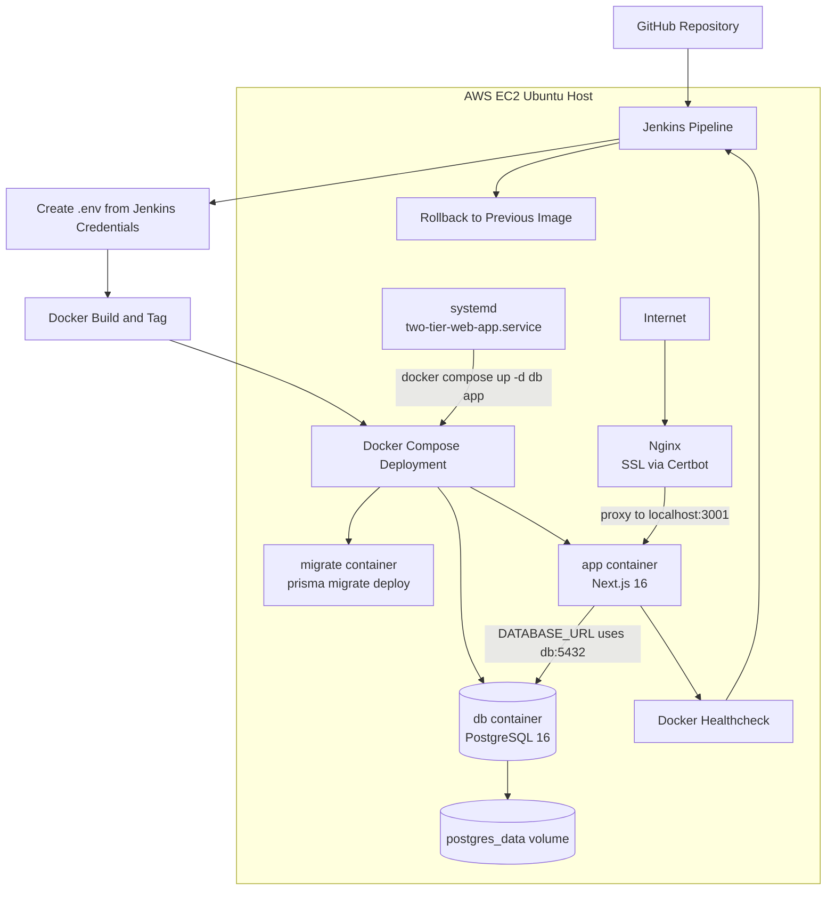

# Two-Tier Web App

Production-style two-tier web application deployed on AWS EC2 with Next.js 16, Prisma, PostgreSQL, Docker Compose, Jenkins CI/CD, Nginx reverse proxy, Certbot SSL, and systemd auto-start.

## System Architecture Overview

- This system runs as a two-tier deployment:
  - Web/application tier: Next.js 16 App Router application in Docker
  - Data tier: PostgreSQL 16 in Docker with persistent storage
- The application serves the task management UI and server-side data operations.
- Prisma connects the Next.js server runtime to PostgreSQL.
- Jenkins builds and deploys the containers.
- Nginx terminates HTTPS and forwards traffic to the application container.
- systemd restores the Docker deployment after server reboot.

## Deployment Architecture

- Host: AWS EC2 Ubuntu
- Source location for deployment: Jenkins workspace at `/var/lib/jenkins/workspace/two-tier-web-app`
- Public domain: `task.rahulkoju.com.np`
- Public entrypoint:
  - `80/tcp` → redirects to HTTPS
  - `443/tcp` → Nginx with Certbot-managed TLS
- Internal application entrypoint:
  - Nginx proxies requests to `http://localhost:3001`
- Containerized services from `docker-compose.yml`:
  - `app` → Next.js server
  - `db` → PostgreSQL
  - `migrate` → one-off Prisma migration runner

## Docker Image Naming Strategy

- `two-tier-web-app:latest` is the active application image used by Docker Compose.
- `two-tier-web-app:<BUILD_NUMBER>` is the versioned Jenkins tag used for traceability and rollback.
- The `app` and `migrate` services both use the same application image, so the code used for migrations and the code used for the running site stay aligned.
- In `docker-compose.yml`, both services must keep:

```yaml
image: two-tier-web-app:latest
```

- The `build:` block remains under `app` and `migrate` so Compose can still build from the project `Dockerfile`.
- This image naming strategy matters because Jenkins and Docker Compose must point to the same image tag. If they do not, Jenkins can finish successfully while the live container still runs older code.

## Service Responsibilities

### App Container

- Built from the project `Dockerfile`
- Installs dependencies with `pnpm`
- Generates Prisma client during image build
- Builds the production Next.js application during image build
- Receives a container healthcheck that probes `http://localhost:3000/api/health`
- Starts at runtime through `scripts/start.sh`
- Runs `pnpm start` and listens on container port `3000`
- Published on host port `3001` through `3001:3000`

### DB Container

- Uses `postgres:16-alpine`
- Initializes database values from runtime environment variables:
  - `POSTGRES_USER`
  - `POSTGRES_PASSWORD`
  - `POSTGRES_DB`
- Persists data in Docker volume `postgres_data`
- Exposes readiness through:

```bash
pg_isready -U ${POSTGRES_USER} -d ${POSTGRES_DB}
```

- Uses `restart: unless-stopped`

### Migrate Container

- Uses the same application image as `app`, `two-tier-web-app:latest`
- Runs:

```bash
npx prisma migrate deploy
```

- Connects to PostgreSQL through Docker DNS hostname `db`
- Starts only after the database healthcheck reports healthy
- Exits after migrations complete

## Container Architecture

- `db` starts first and initializes PostgreSQL with the runtime credentials from `.env`.
- `migrate` waits on `db` health, connects to `db:5432`, and applies the committed Prisma migrations.
- `app` waits on `db` health, starts the production Next.js server, and reads `DATABASE_URL` at runtime.
- `app` reports healthy only after its `/api/health` endpoint returns success.
- `app` and `migrate` both use:

```text
postgresql://${POSTGRES_USER}:${POSTGRES_PASSWORD}@db:5432/${POSTGRES_DB}
```

- Database persistence is outside the container filesystem through the named volume `postgres_data`.

## Networking Flow

- User request flow:
  - User → `task.rahulkoju.com.np` → Nginx → `localhost:3001` → `app` container → `db` container
- TLS termination happens at Nginx.
- Nginx forwards the original host header and upgrade headers to the app container.
- The application never connects to PostgreSQL through `localhost`.
- Docker internal service discovery resolves `db` to the PostgreSQL container IP on the Compose network.

### Nginx Reverse Proxy

- Site file: `/etc/nginx/sites-available/task.rahulkoju.com.np`
- HTTPS virtual host:
  - `server_name task.rahulkoju.com.np;`
  - `listen 443 ssl;`
  - `proxy_pass http://localhost:3001;`
- HTTP virtual host:
  - listens on port `80`
  - redirects `task.rahulkoju.com.np` to HTTPS with `301`
- TLS assets are managed by Certbot:
  - `/etc/letsencrypt/live/task.rahulkoju.com.np/fullchain.pem`
  - `/etc/letsencrypt/live/task.rahulkoju.com.np/privkey.pem`
  - `/etc/letsencrypt/options-ssl-nginx.conf`
  - `/etc/letsencrypt/ssl-dhparams.pem`

## Deployment Flow

### Manual Docker Flow

1. Build the application image:

```bash
docker compose build app
docker tag two-tier-web-app:latest two-tier-web-app:<tag>
```

2. Start PostgreSQL:

```bash
docker compose up -d db
```

3. Wait for the database healthcheck to pass.

4. Run Prisma migrations:

```bash
docker compose run --rm migrate
```

5. Start the application:

```bash
docker compose up -d app
```

6. Wait for the app healthcheck to report healthy.

7. Verify running services:

```bash
docker compose ps
```

### Automated CI/CD Flow

- Git push updates the repository tracked by Jenkins.
- Jenkins checks out the latest source.
- Jenkins creates a runtime `.env` file from stored credentials.
- Jenkins builds the Compose `app` image, which produces `two-tier-web-app:latest`.
- Jenkins tags `two-tier-web-app:latest` as `two-tier-web-app:<BUILD_NUMBER>`.
- Jenkins starts the database container.
- Jenkins waits until PostgreSQL reaches Docker health status `healthy`.
- Jenkins runs the migration container.
- Jenkins force-recreates only the `app` container with Docker Compose.
- Jenkins waits until the app container healthcheck reports healthy.
- Jenkins verifies the resulting Compose state.
- If deployment verification fails, Jenkins retags the last known-good image as `latest` and recreates the app through Docker Compose.

This separation keeps responsibilities clear:

- Jenkins handles build, deployment orchestration, health verification, and rollback decisions.
- Docker Compose defines and runs the `db`, `migrate`, and `app` services.
- Nginx provides the public HTTPS entrypoint and forwards traffic to the app container on host port `3001`.
- systemd restores the Compose deployment after server reboot.

## CI/CD Pipeline Breakdown

The `Jenkinsfile` runs these stages in order:

### Checkout

- Runs `checkout scm`
- Pulls the repository contents into the Jenkins workspace

### Create .env

- Reads Jenkins credentials:
  - `POSTGRES_USER`
  - `POSTGRES_PASSWORD`
  - `POSTGRES_DB`
- Writes a local `.env` file used by Docker Compose

### Build Docker Image

- Runs:

```bash
docker compose build app
docker tag ${IMAGE_NAME}:latest ${IMAGE_NAME}:${IMAGE_TAG}
```

- Builds the `app` service image from the repository `Dockerfile`
- Produces `two-tier-web-app:latest` through the Compose build
- Tags that built image with the current Jenkins `BUILD_NUMBER`
- Keeps the Compose runtime image and the Jenkins-tagged image aligned
- Prints matching Docker images for verification

### Run Migrations

- Starts the database container:

```bash
docker compose up -d db
```

- Polls the DB container health status until Docker reports `healthy`:

```bash
docker inspect --format='{{if .State.Health}}{{.State.Health.Status}}{{else}}no-healthcheck{{end}}' $(docker compose ps -q db)
```

- Runs the migration container:

```bash
docker compose run --rm migrate
```

### Deploy

- Runs:

```bash
docker compose up -d --no-deps --force-recreate app
```

- Recreates only the `app` service from the newly built image
- Leaves the database container running during application rollout

### Verify

- Waits for the app container `two-tier-web-app` to reach Docker health status `healthy`
- Retries up to 12 times with 10-second intervals
- Fails the deployment if the healthcheck never becomes healthy
- The app healthcheck succeeds only when `GET /api/health` can reach PostgreSQL and `SELECT 1` succeeds
- Runs:

```bash
docker compose ps
```

- Confirms the service state after deployment

### Post Actions

- On failure:
  - prints `Pipeline failed! Attempting rollback...`
  - recreates `.env` from Jenkins credentials before rollback
  - reads the rollback target from `.rollback-image`, copied from the previous successful deployment marker
  - checks whether that last known-good image exists locally with `docker image inspect`
  - retags the last known-good image as `two-tier-web-app:latest`
  - starts `db` with `docker compose up -d db`
  - recreates `app` with `docker compose up -d --no-deps --force-recreate app`
  - keeps rollback inside Docker Compose instead of switching to a raw `docker run` path
  - verifies rollback health with the same Docker health polling loop
  - prints `No last-known-good image found. Cannot rollback.` when no rollback marker exists
  - prints final Compose status with `docker compose ps`
  - runs `docker compose logs app`
- On success:
  - prints `Deployment successful!`
  - records `${IMAGE_NAME}:${IMAGE_TAG}` in `.last-known-good-image`
  - prunes Docker images older than 24 hours

## Runtime Behavior

- The Docker image is built once per deployment cycle.
- During image build:
  - dependencies are installed
  - PostgreSQL client tools are installed in the image
  - project files are copied in
  - Prisma client is generated
  - Next.js production build is created
- During runtime:
  - `db` starts and initializes PostgreSQL if the volume does not already contain data
  - Compose waits for the `db` healthcheck before allowing dependent services to proceed
  - `migrate` runs only when explicitly invoked by the deployment flow
  - `app` starts with `pnpm start` through `scripts/start.sh`
  - Docker marks the app healthy only after `/api/health` returns HTTP 200
  - Nginx serves HTTPS and forwards requests to the app on `localhost:3001`
- The application becomes publicly available only after:
  - the app container is running
  - port `3001` is bound on the host
  - Nginx is serving the domain over HTTPS

## Restart, Failure Handling, and Recovery

### If the DB Is Not Ready

- `app` does not start until `db` is healthy because of `depends_on` with `condition: service_healthy`
- `migrate` does not run until the same healthcheck passes

### If Migration Fails

- `docker compose run --rm migrate` exits with failure
- Jenkins stops the pipeline at the migration stage
- The deploy stage does not complete until migrations succeed

### If the App Fails Health Verification

- Jenkins polls Docker health status for container `two-tier-web-app`
- If the container never becomes healthy within 12 checks at 10-second intervals, the verify stage fails
- The pipeline enters the failure block, retags the last known-good image as `two-tier-web-app:latest`, and recreates the app with Docker Compose

### If the App Crashes

- The `app` service uses `restart: unless-stopped`
- Docker restarts the container automatically unless it was intentionally stopped
- The same container also exposes a Docker healthcheck used by Jenkins verification

### If the DB Crashes

- The `db` service uses `restart: unless-stopped`
- Docker restarts the container automatically unless it was intentionally stopped

## App Healthcheck

- `GET /api/health` is the application readiness endpoint.
- It returns `200` when the Next.js server is reachable and Prisma can execute `SELECT 1` against PostgreSQL.
- It returns `503` when the app process is running but database connectivity fails.
- Docker Compose uses this endpoint for the `app` container healthcheck.

## Manual Failure Drills

### Kill the app container

```bash
docker compose kill app
docker compose ps
```

- Expected result: Docker restarts `app` because of `restart: unless-stopped`, and health returns to `healthy`.

### Stop the DB container

```bash
docker compose stop db
docker compose ps
curl -i http://localhost:3001/api/health
```

- Expected result: `/api/health` returns `503`, the app healthcheck turns unhealthy, and task operations fail with the existing safe DB error handling.

### Break DB connectivity for the app

```bash
POSTGRES_PASSWORD=wrong-password docker compose up -d --no-deps --force-recreate app
curl -i http://localhost:3001/api/health
```

- Expected result: the app process comes up with bad DB credentials, `/api/health` returns `503`, and Jenkins verification would fail for the same condition.

### Validate rollback

1. Leave the last successful deployment marker in place.
2. Deploy a bad app image or a bad app DB configuration so Verify fails.
3. Inspect the Jenkins post-failure logs.

- Expected result: Jenkins retags the image stored in `.rollback-image`, recreates `app`, and the container returns to `healthy`.

### On Server Reboot

- `systemd` unit: `/etc/systemd/system/two-tier-web-app.service`
- Unit definition:
  - `Requires=docker.service`
  - `After=docker.service network-online.target`
  - `Type=oneshot`
  - `RemainAfterExit=yes`
  - `WorkingDirectory=/var/lib/jenkins/workspace/two-tier-web-app`
  - `ExecStart=/usr/bin/docker compose up -d db app`
  - `ExecStop=/usr/bin/docker compose down`
- Boot behavior:
  - Docker starts first
  - systemd runs `docker compose up -d db app`
  - PostgreSQL and the application are restored from the last deployed Compose configuration
- This reboot path is only for reboot recovery. It starts `db` and `app` only.
- It does not run the `migrate` container automatically.
- Jenkins remains responsible for running migrations during normal deployments.

## Troubleshooting Deployment Image Mismatch

- If the website does not show the latest deployed code, first confirm which images exist:

```bash
docker images
```

- Then confirm which image the running containers are actually using:

```bash
docker ps --format "table {{.Names}}\t{{.Image}}\t{{.Status}}"
```

- Check that the running application container is using `two-tier-web-app:latest`.
- If the running container image name does not match `two-tier-web-app:latest`, the active Compose deployment is not using the expected application image.

## Security and Environment Handling

- Database secrets are not hardcoded into the Docker image.
- Runtime environment values are injected through Docker Compose.
- Jenkins writes the `.env` file during deployment from managed credentials instead of committing secrets to the repository.
- `DATABASE_URL` is constructed at runtime for both `app` and `migrate`.
- Jenkins deploys versioned images using the current `BUILD_NUMBER` and retains `latest` as the active tag alias.
- TLS termination and certificate files are handled at the Nginx layer through Certbot-managed files on the EC2 host.

## Final Architecture Diagram



## Verification

- Development server: `pnpm dev`
- Lint: `pnpm lint`
- Production build: `pnpm build`
