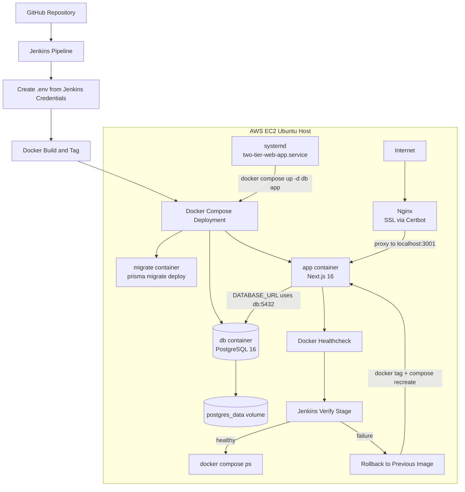

# Two-Tier Web App

Production-style two-tier web application deployed on AWS EC2 with Next.js 16, Prisma, PostgreSQL, Docker Compose, Jenkins CI/CD, Nginx reverse proxy, Certbot SSL, and systemd auto-start.

## Table of Contents

- [Prerequisites](#prerequisites)
- [Quick Start](#quick-start)
- [System Architecture Overview](#system-architecture-overview)
- [Deployment Architecture](#deployment-architecture)
- [Docker Image Naming Strategy](#docker-image-naming-strategy)
- [Service Responsibilities](#service-responsibilities)
- [Container Architecture](#container-architecture)
- [Networking Flow](#networking-flow)
- [Deployment Flow](#deployment-flow)
- [CI/CD Pipeline Breakdown](#cicd-pipeline-breakdown)
- [Runtime Behavior](#runtime-behavior)
- [Restart, Failure Handling, and Recovery](#restart-failure-handling-and-recovery)
- [App Healthcheck](#app-healthcheck)
- [Manual Failure Drills](#manual-failure-drills)
- [Troubleshooting Deployment Image Mismatch](#troubleshooting-deployment-image-mismatch)
- [Security and Environment Handling](#security-and-environment-handling)
- [Environment Variables Reference](#environment-variables-reference)
- [Build Inputs](#build-inputs)
- [Final Architecture Diagram](#final-architecture-diagram)
- [Rollback Reference](#rollback-reference)
- [Verification](#verification)

## Prerequisites

Install these components on the EC2 host before deployment:

- Docker Engine with support for the `docker compose` subcommand. The deployment flow and Jenkins pipeline both use `docker compose` rather than `docker-compose`.
- Docker Compose plugin or equivalent `docker compose` support. No separate version is stated in the repository content.
- Jenkins. The deployment source location is the Jenkins workspace at `/var/lib/jenkins/workspace/two-tier-web-app`, and the pipeline depends on Jenkins-managed credentials for `POSTGRES_USER`, `POSTGRES_PASSWORD`, and `POSTGRES_DB`.
- Nginx. The public entrypoint terminates TLS on ports `80` and `443` and proxies traffic to `http://localhost:3001`.
- Certbot. TLS assets are expected under `/etc/letsencrypt/`.
- systemd. Reboot recovery depends on `/etc/systemd/system/two-tier-web-app.service` and `docker compose up -d db app`.
- Node.js 22, if you plan to run local validation commands directly on the host. This version is inferred from the build image `node:22-alpine`.
- pnpm 11.1.3, if you plan to run local validation commands directly on the host. This version is inferred from `corepack prepare pnpm@11.1.3 --activate`.

PostgreSQL does not need to be installed on the host because the data tier runs as the `postgres:16-alpine` container image.

## Quick Start

1. Clone this repository into the Jenkins-tracked workspace at `/var/lib/jenkins/workspace/two-tier-web-app`.
2. Install and configure the host prerequisites in [Prerequisites](#prerequisites), including Nginx, Certbot, Docker with `docker compose`, Jenkins credentials, and the systemd unit.
3. In Jenkins, configure the `POSTGRES_USER`, `POSTGRES_PASSWORD`, and `POSTGRES_DB` credentials so the pipeline can create the runtime `.env` file.
4. Trigger the Jenkins pipeline so it runs checkout, `.env` creation, image build, migrations, deployment, and verification as described in [Deployment Flow](#deployment-flow) and [CI/CD Pipeline Breakdown](#cicd-pipeline-breakdown).
5. Confirm the site is reachable at `https://task.rahulkoju.com.np` and review the checks in [Verification](#verification).

## System Architecture Overview

This system runs as a two-tier deployment with a web/application tier and a data tier. The web tier is a Next.js 16 App Router application in Docker, and the data tier is PostgreSQL 16 in Docker with persistent storage. The application serves the task management UI and server-side data operations, while Prisma connects the Next.js server runtime to PostgreSQL.

Jenkins builds and deploys the containers, Nginx terminates HTTPS and forwards traffic to the application container, and systemd restores the Docker deployment after server reboot.

## Deployment Architecture

The deployment target is an AWS EC2 Ubuntu host, and the source location for deployment is the Jenkins workspace at `/var/lib/jenkins/workspace/two-tier-web-app`. The public domain is `task.rahulkoju.com.np`. Port `80/tcp` redirects to HTTPS, and port `443/tcp` serves Nginx with Certbot-managed TLS. Internally, Nginx proxies requests to `http://localhost:3001`.

The `docker-compose.yml` file defines three containerized services: `app` for the Next.js server, `db` for PostgreSQL, and `migrate` for the one-off Prisma migration runner.

## Docker Image Naming Strategy

`two-tier-web-app:latest` is the active application image used by the `app` service, while `two-tier-web-app:<BUILD_NUMBER>` is the versioned Jenkins tag used for traceability and rollback. The `migrate` service now uses its own image tag, `two-tier-web-app:migrator`, built from the dedicated `migrator` stage in the project `Dockerfile`.

In `docker-compose.yml`, the service image tags are:

```yaml
app:
  image: two-tier-web-app:latest

migrate:
  image: two-tier-web-app:migrator
```

The `build:` block remains under both services so Compose can build `app` from the default final stage and `migrate` from the `migrator` target. This image naming strategy matters because Jenkins and Docker Compose must keep the active app image aligned while still providing a dedicated migration runner that does not depend on Prisma being available in the runtime container.

## Service Responsibilities

### App Container

The app container is built from the project `Dockerfile` with a multi-stage build that uses a `builder` stage and a slim `runner` stage. It installs dependencies with `pnpm` in the build stage, generates the Prisma client during image build, and builds the production Next.js application as a standalone server during image build.

The runtime image copies only the standalone server output, static assets, Prisma runtime assets, and Prisma schema. The `public/` copy line is currently disabled in `Dockerfile`. It receives a container healthcheck that probes `http://localhost:3000/api/health` through a small Node.js HTTP request, starts through `scripts/start.sh`, runs `node server.js`, listens on container port `3000`, and is published on host port `3001` through `3001:3000`. It uses `NODE_ENV=production`, `NODE_OPTIONS=--max-old-space-size=512`, `HOSTNAME=0.0.0.0`, and Compose resource limits of `600m` memory and `1.0` CPU.

### DB Container

The DB container uses `postgres:16-alpine` and initializes database values from the runtime environment variables `POSTGRES_USER`, `POSTGRES_PASSWORD`, and `POSTGRES_DB`. It persists data in the Docker volume `postgres_data`, starts with tuned PostgreSQL runtime settings for a smaller EC2 footprint, uses a Compose memory limit of `256m`, and uses `restart: unless-stopped`.

The tuned PostgreSQL settings are:

- `shared_buffers=64MB`
- `effective_cache_size=128MB`
- `work_mem=4MB`
- `maintenance_work_mem=32MB`
- `max_connections=20`

It exposes readiness through:

```bash
pg_isready -U ${POSTGRES_USER} -d ${POSTGRES_DB}
```

### Migrate Container

The migrate container uses the dedicated image tag `two-tier-web-app:migrator`, built from the `migrator` Dockerfile stage, and runs:

```bash
prisma migrate deploy
```

It packages the Prisma CLI, Prisma engines, schema, and Prisma config copied from the builder stage. It connects to PostgreSQL through the Docker DNS hostname `db`, starts only after the database healthcheck reports healthy, and exits after migrations complete.

## Container Architecture

`db` starts first and initializes PostgreSQL with the runtime credentials from `.env`. `migrate` waits on `db` health, connects to `db:5432`, and applies the committed Prisma migrations. `app` waits on `db` health, starts the production Next.js server, and reads `DATABASE_URL` at runtime. The app reports healthy only after its `/api/health` endpoint returns success.

Both `app` and `migrate` use:

```text
postgresql://${POSTGRES_USER}:${POSTGRES_PASSWORD}@db:5432/${POSTGRES_DB}
```

Database persistence is outside the container filesystem through the named volume `postgres_data`.

## Networking Flow

User request flow is `User → task.rahulkoju.com.np → Nginx → localhost:3001 → app container → db container`. TLS termination happens at Nginx, and Nginx forwards the original host header and upgrade headers to the app container. The application never connects to PostgreSQL through `localhost`; Docker internal service discovery resolves `db` to the PostgreSQL container IP on the Compose network.

### Nginx Reverse Proxy

The site file is `/etc/nginx/sites-available/task.rahulkoju.com.np`. The HTTPS virtual host uses `server_name task.rahulkoju.com.np;`, listens on `443 ssl;`, and proxies with `proxy_pass http://localhost:3001;`. The HTTP virtual host listens on port `80` and redirects `task.rahulkoju.com.np` to HTTPS with `301`.

TLS assets are managed by Certbot:

- `/etc/letsencrypt/live/task.rahulkoju.com.np/fullchain.pem`
- `/etc/letsencrypt/live/task.rahulkoju.com.np/privkey.pem`
- `/etc/letsencrypt/options-ssl-nginx.conf`
- `/etc/letsencrypt/ssl-dhparams.pem`

## Deployment Flow

### Manual Docker Flow

1. Build the application image:

```bash
docker compose build --no-cache app
docker tag two-tier-web-app:latest two-tier-web-app:<tag>
```

The build uses `next.config.ts` with `output: "standalone"` so the runtime container can boot directly from `server.js`.

2. Start PostgreSQL:

```bash
docker compose up -d db
```

3. Wait for the database healthcheck to pass.
4. Run Prisma migrations:

```bash
docker compose run --rm migrate
```

5. Start the application:

```bash
docker compose up -d app
```

6. Wait for the app healthcheck to report healthy.
7. Verify running services:

```bash
docker compose ps
```

### Automated CI/CD Flow

Git push updates the repository tracked by Jenkins, and Jenkins checks out the latest source. It creates a runtime `.env` file from stored credentials, builds the Compose `app` image with `--no-cache`, which produces `two-tier-web-app:latest`, and tags that image as `two-tier-web-app:<BUILD_NUMBER>`. Jenkins then starts the database container, waits until PostgreSQL reaches Docker health status `healthy`, runs the dedicated migration container, and force-recreates only the `app` container with Docker Compose.

After deployment, Jenkins waits until the app container healthcheck reports healthy and verifies the resulting Compose state. If deployment verification fails, Jenkins retags the last known-good image as `latest` and recreates the app through Docker Compose.

This separation keeps responsibilities clear. Jenkins handles build, deployment orchestration, health verification, and rollback decisions. Docker Compose defines and runs the `db`, `migrate`, and `app` services. Nginx provides the public HTTPS entrypoint and forwards traffic to the app container on host port `3001`, and systemd restores the Compose deployment after server reboot.

## CI/CD Pipeline Breakdown

The `Jenkinsfile` runs these stages in order.

### Checkout

This stage runs `checkout scm` and pulls the repository contents into the Jenkins workspace.

### Create .env

This stage reads the Jenkins credentials `POSTGRES_USER`, `POSTGRES_PASSWORD`, and `POSTGRES_DB`, then writes a local `.env` file used by Docker Compose.

### Build Docker Image

This stage runs:

```bash
docker compose build --no-cache app
docker tag ${IMAGE_NAME}:latest ${IMAGE_NAME}:${IMAGE_TAG}
```

It builds the `app` service image from the repository `Dockerfile`, uses a multi-stage build on `node:22-alpine`, bypasses Docker layer cache for that build, produces `two-tier-web-app:latest` through the Compose build, tags that built image with the current Jenkins `BUILD_NUMBER`, keeps the Compose runtime image and the Jenkins-tagged image aligned, and prints matching Docker images for verification.

### Run Migrations

This stage is wrapped in Jenkins credentials so Compose can resolve the runtime database variables before starting containers. It starts the database container:

```bash
docker compose up -d db
```

It then polls the DB container health status until Docker reports `healthy`:

```bash
docker inspect --format='{{if .State.Health}}{{.State.Health.Status}}{{else}}no-healthcheck{{end}}' $(docker compose ps -q db)
```

After the database is healthy, it runs the migration container:

```bash
docker compose run --rm migrate
```

### Deploy

This stage is also wrapped in Jenkins credentials so the `app` service receives the constructed `DATABASE_URL`. It runs:

```bash
docker compose up -d --no-deps --force-recreate app
```

It recreates only the `app` service from the newly built image and leaves the database container running during application rollout.

### Verify

This stage waits for the app container `two-tier-web-app` to reach Docker health status `healthy`, retries up to 12 times with 10-second intervals, and fails the deployment if the healthcheck never becomes healthy. The app healthcheck succeeds only when `GET /api/health` can reach PostgreSQL and `SELECT 1` succeeds.

It then runs:

```bash
docker compose ps
```

This confirms the service state after deployment.

### Post Actions

On failure, the pipeline prints `Pipeline failed! Attempting rollback...`, recreates `.env` from Jenkins credentials before rollback, reads the rollback target from `.rollback-image`, copied from the previous successful deployment marker, checks whether that last known-good image exists locally with `docker image inspect`, retags the last known-good image as `two-tier-web-app:latest`, starts `db` with `docker compose up -d db`, recreates `app` with `docker compose up -d --no-deps --force-recreate app`, keeps rollback inside Docker Compose instead of switching to a raw `docker run` path, verifies rollback health with the same Docker health polling loop, prints `No last-known-good image found. Cannot rollback.` when no rollback marker exists, prints final Compose status with `docker compose ps`, and runs `docker compose logs app`.

On success, the pipeline prints `Deployment successful!`, records `${IMAGE_NAME}:${IMAGE_TAG}` in `.last-known-good-image`, and prunes Docker images older than 24 hours.

## Runtime Behavior

The Docker image is built once per deployment cycle. During image build, dependencies are installed with `pnpm install --frozen-lockfile`, project files are copied in, Prisma client is generated, Next.js production build is created with standalone output enabled, the dedicated `migrator` stage is prepared with Prisma CLI assets, and the final runtime image receives only the standalone server, static assets, and Prisma runtime files.

During runtime, `db` starts and initializes PostgreSQL if the volume does not already contain data, Compose waits for the `db` healthcheck before allowing dependent services to proceed, `migrate` runs only when explicitly invoked by the deployment flow, and `app` starts with `node server.js` through `scripts/start.sh` while binding through `HOSTNAME=0.0.0.0`. Docker marks the app healthy only after the Node-based healthcheck receives HTTP 200 from `/api/health`, Docker log rotation keeps app logs capped at `10m` per file with `3` retained files, and Nginx serves HTTPS and forwards requests to the app on `localhost:3001`.

The application becomes publicly available only after the app container is running, port `3001` is bound on the host, and Nginx is serving the domain over HTTPS.

## Restart, Failure Handling, and Recovery

### If the DB Is Not Ready

`app` does not start until `db` is healthy because of `depends_on` with `condition: service_healthy`, and `migrate` does not run until the same healthcheck passes.

### If Migration Fails

`docker compose run --rm migrate` exits with failure, Jenkins stops the pipeline at the migration stage, and the deploy stage does not complete until migrations succeed.

### If the App Fails Health Verification

Jenkins polls Docker health status for container `two-tier-web-app`. If the container never becomes healthy within 12 checks at 10-second intervals, the verify stage fails. The pipeline then enters the failure block, retags the last known-good image as `two-tier-web-app:latest`, and recreates the app with Docker Compose.

### If the App Crashes

The `app` service uses `restart: unless-stopped`, so Docker restarts the container automatically unless it was intentionally stopped. The same container also exposes a Docker healthcheck used by Jenkins verification.

### If the DB Crashes

The `db` service uses `restart: unless-stopped`, so Docker restarts the container automatically unless it was intentionally stopped.

## App Healthcheck

`GET /api/health` is the application readiness endpoint. It returns `200` when the Next.js server is reachable and Prisma can execute `SELECT 1` against PostgreSQL. It returns `503` when the app process is running but database connectivity fails. Docker Compose uses this endpoint for the `app` container healthcheck through a Node.js inline HTTP request rather than `wget`.

## Manual Failure Drills

### Kill the app container

```bash
docker compose kill app
docker compose ps
```

Expected result: Docker restarts `app` because of `restart: unless-stopped`, and health returns to `healthy`.

### Stop the DB container

```bash
docker compose stop db
docker compose ps
curl -i http://localhost:3001/api/health
```

Expected result: `/api/health` returns `503`, the app healthcheck turns unhealthy, and task operations fail with the existing safe DB error handling.

### Break DB connectivity for the app

```bash
POSTGRES_PASSWORD=wrong-password docker compose up -d --no-deps --force-recreate app
curl -i http://localhost:3001/api/health
```

Expected result: the app process comes up with bad DB credentials, `/api/health` returns `503`, and Jenkins verification would fail for the same condition.

### Validate rollback

1. Leave the last successful deployment marker in place.
2. Deploy a bad app image or a bad app DB configuration so Verify fails.
3. Inspect the Jenkins post-failure logs.

Expected result: Jenkins retags the image stored in `.rollback-image`, recreates `app`, and the container returns to `healthy`.

### On Server Reboot

The `systemd` unit is `/etc/systemd/system/two-tier-web-app.service`.

The unit definition is:

- `Requires=docker.service`
- `After=docker.service network-online.target`
- `Type=oneshot`
- `RemainAfterExit=yes`
- `WorkingDirectory=/var/lib/jenkins/workspace/two-tier-web-app`
- `ExecStart=/usr/bin/docker compose up -d db app`
- `ExecStop=/usr/bin/docker compose down`

Boot behavior is straightforward: Docker starts first, systemd runs `docker compose up -d db app`, and PostgreSQL and the application are restored from the last deployed Compose configuration. This reboot path is only for reboot recovery. It starts `db` and `app` only, does not run the `migrate` container automatically, and leaves Jenkins responsible for running migrations during normal deployments.

## Troubleshooting Deployment Image Mismatch

If the website does not show the latest deployed code, first confirm which images exist:

```bash
docker images
```

Then confirm which image the running containers are actually using:

```bash
docker ps --format "table {{.Names}}\t{{.Image}}\t{{.Status}}"
```

Check that the running application container is using `two-tier-web-app:latest`. If the running container image name does not match `two-tier-web-app:latest`, the active Compose deployment is not using the expected application image.

## Security and Environment Handling

Database secrets are not hardcoded into the Docker image. Runtime environment values are injected through Docker Compose, and Jenkins writes the `.env` file during deployment from managed credentials instead of committing secrets to the repository. `DATABASE_URL` is constructed at runtime for both `app` and `migrate`.

Jenkins deploys versioned images using the current `BUILD_NUMBER` and retains `latest` as the active tag alias. TLS termination and certificate files are handled at the Nginx layer through Certbot-managed files on the EC2 host.

## Environment Variables Reference

| Variable | Where Used | Set By | Description |
| --- | --- | --- | --- |
| `POSTGRES_USER` | `db` service environment, DB healthcheck, runtime `DATABASE_URL` construction for `app` and `migrate`, Jenkins-created `.env` | Jenkins credentials written into `.env` | PostgreSQL username used to initialize the database container and compose the runtime connection string. |
| `POSTGRES_PASSWORD` | `db` service environment, runtime `DATABASE_URL` construction for `app` and `migrate`, Jenkins-created `.env` | Jenkins credentials written into `.env` | PostgreSQL password used to initialize the database container and compose the runtime connection string. |
| `POSTGRES_DB` | `db` service environment, DB healthcheck, runtime `DATABASE_URL` construction for `app` and `migrate`, Jenkins-created `.env` | Jenkins credentials written into `.env` | PostgreSQL database name used to initialize the database container and compose the runtime connection string. |
| `DATABASE_URL` | `app` and `migrate` service environment in `docker-compose.yml`; local development example in `.env.example` | Constructed by Docker Compose for `app` and `migrate`; manually defined in `.env.example` for local development | PostgreSQL connection string used by the application runtime and Prisma migration runner. |
| `NODE_ENV` | `app` service environment; runtime image environment | `docker-compose.yml` and the runtime image | Runs the application in production mode. |
| `NODE_OPTIONS` | `app` service environment | `docker-compose.yml` | Sets Node.js runtime memory options with `--max-old-space-size=512`. |
| `HOSTNAME` | `app` service environment | `docker-compose.yml` | Binds the Next.js server to `0.0.0.0` so it is reachable from outside the container. |

## Build Inputs

`.dockerignore` excludes local-only and large build-context paths:

- `node_modules`
- `.next`
- `.git`
- `.env`
- `npm-debug.log*`
- `pnpm-debug.log*`

`pnpm-workspace.yaml` allows required install-time builds for:

- `@prisma/engines`
- `prisma`
- `sharp`
- `unrs-resolver`

## Final Architecture Diagram



## Rollback Reference

The last successful deployment is recorded in `.last-known-good-image`, and the deploy stage copies that value into `.rollback-image` before it recreates the `app` container. If the Verify stage fails, Jenkins reads `.rollback-image`, checks whether that image exists locally, retags it as `two-tier-web-app:latest`, and recreates the app through Docker Compose.

To trigger the documented rollback path manually, keep the last successful deployment marker in place and deploy a bad app image or a bad app DB configuration so Verify fails, as described in [Manual Failure Drills](#manual-failure-drills). There is no separate rollback stage described in the repository content; rollback is entered from the pipeline failure path.

Jenkins uses these Docker commands during rollback:

```bash
docker image inspect "$ROLLBACK_IMAGE" > /dev/null 2>&1
docker tag "$ROLLBACK_IMAGE" ${IMAGE_NAME}:latest
docker compose up -d db
docker compose up -d --no-deps --force-recreate app
docker inspect --format='{{if .State.Health}}{{.State.Health.Status}}{{else}}no-healthcheck{{end}}' two-tier-web-app
docker compose ps
docker compose logs app
```

## Verification

Use these commands for validation:

- Development server: `pnpm dev`
- Lint: `pnpm lint`
- Production build: `pnpm build`
